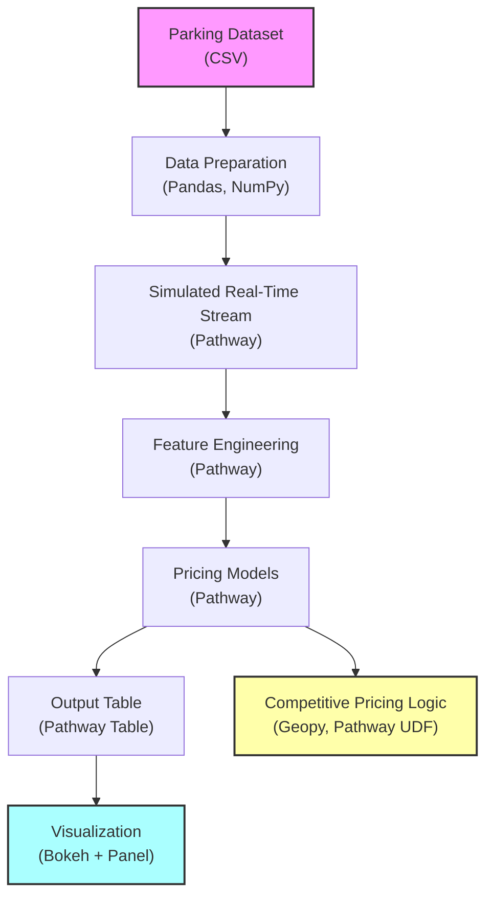

# Dynamic Pricing for Urban Parking Lots

**Capstone Project – Summer Analytics 2025**  
Saisha Verma | Gmail : saishaverma0512@gmail.com | Github : [@Saisha0512](https://github.com/Saisha0512)

---

## 📝 Overview

This project implements a **real-time dynamic pricing engine for urban parking lots**. The system simulates live streaming data from 14 different parking lots, processes it in real-time to engineer features, and applies advanced pricing models to optimize parking prices based on demand, congestion, and competition. It also includes interactive visualizations for monitoring pricing adjustments and demand over time.

---

## 🛠️ Tech Stack

- **Python**: Core programming language for all logic
- **Pandas, NumPy**: Data cleaning, feature engineering, and manipulation
- **Pathway**: Real-time data streaming, windowing, and pipeline orchestration
- **Bokeh, Panel**: Real-time interactive visualization/dashboard
- **Geopy**: Geospatial calculations for competitive pricing
- **Jupyter Notebook**: Prototyping and documentation

---

## 🗺️ Architecture Diagram



---

## ⚙️ Project Architecture & Workflow

### 1. Data Preparation

- **Input**: Historical dataset for 14 parking lots (occupancy, queue, traffic, vehicle type, etc.)
- **Processing**: 
  - Clean and preprocess data (fill missing, encode categorical)
  - Generate a CSV stream for real-time simulation

### 2. Real-Time Simulation (Pathway)

- **Streaming**: The prepared CSV is streamed in real-time using Pathway’s replay mechanism (`pw.demo.replay_csv`).
- **Feature Engineering**: 
  - Timestamp parsing
  - Occupancy rate calculation
  - Demand estimation (based on queue, traffic, vehicle type, etc.)

### 3. Pricing Models

#### a. Baseline Linear Model
- **Logic**: Price increases linearly with occupancy rate.
- **Purpose**: Reference/simple model.

#### b. Demand-Based Pricing Model
- **Logic**: 
  - Demand score is calculated from queue, traffic, special day, vehicle type.
  - Demand is normalized within the daily window.
  - Price = Base Price × (1 + λ × Normalized Demand)
- **Purpose**: Reacts to real-time demand fluctuations.

#### c. Competitive Pricing Model
- **Logic**:
  - For each lot, compute the nearest other lot (geodesic distance).
  - If a lot is less occupied and more expensive than its nearest competitor, suggest rerouting or price decrease.
- **Purpose**: Avoid being undercut by nearby lots, encourage price competition.

### 4. Real-Time Visualization

- **Dashboard**: 
  - Interactive plot for daily price per lot.
  - Optionally, compare with competitor’s price.
  - Built using Bokeh and Panel for live updates.

### 5. Extensibility

- **Assumptions**: All logic is built from scratch (no black-box ML).
- **Modular**: New features, pricing strategies, or real-world API connections can be plugged in easily.

---

## 📑 Example Project Workflow

1. **Load and preprocess the dataset** with Pandas.
2. **Start a real-time stream** of parking lot data using Pathway.
3. **Apply feature engineering** and calculate demand metrics.
4. **Run daily windowing** to aggregate data and compute prices.
5. **Calculate competitive suggestions** using nearest-lot logic.
6. **Visualize prices and demand** for any lot in an interactive dashboard.

---

## 📄 Additional Documentation

- **Dataset Columns**: `SystemCodeNumber`, `Capacity`, `Occupancy`, `QueueLength`, `TrafficConditionNearby`, `IsSpecialDay`, `VehicleType`, `Latitude`, `Longitude`, `Timestamp`
- **Pricing Model Parameters**: Tunable base price, demand coefficients, and window length.
- **Code Structure**: All code is contained in a single Jupyter Notebook for transparency and reproducibility.

---

## 🚀 Acknowledgements

- **Pathway** for open-source real-time data streaming.
- **Summer Analytics 2025** for the problem statement and dataset.

---

> For questions or collaboration, contact:  
> **Saisha Verma**  
> saishaverma0512@gmail.com

```
